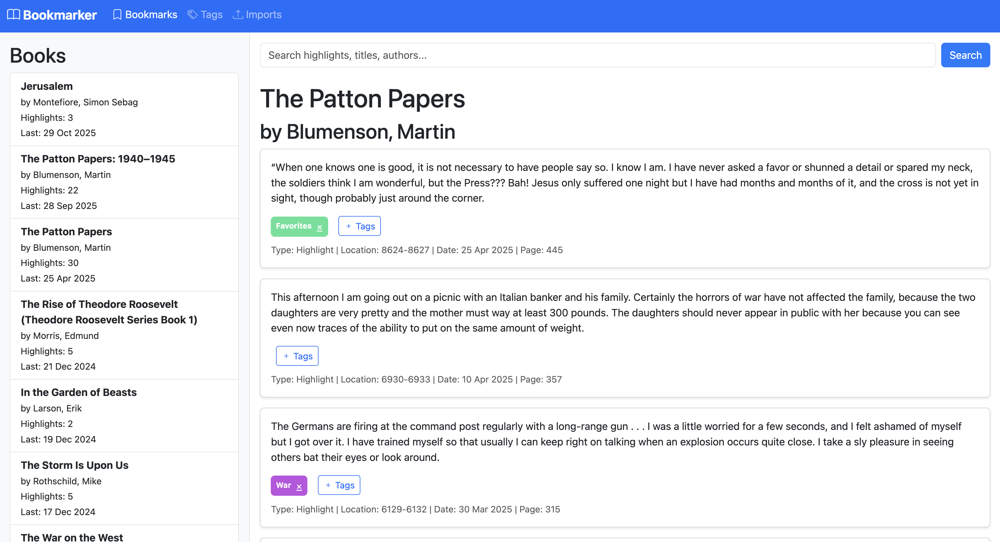

# BookMarker

A simple web app for managing and searching your Kindle highlights. Import your "My Clippings.txt" file and browse your reading highlights through a clean interface.



## Quick Start

1. **Clone or download** the repository
2. **Run the build script** to create an executable:
   ```bash
   ./build.sh
   ```
3. **Run the app**:
   ```bash
   ./dist/run
   ```
4. Open your browser to `http://localhost:5001`

## Setup Details

- Place your "My Clippings.txt" file in the project root
- The app will automatically import new highlights on startup
- Search across all your highlights and books

## Requirements

- Python 3.12+
- Dependencies listed in `requirements.txt`

## Development

For development setup, see the full documentation or run tests with `python -m pytest tests/`.

---

**Note**: Designed for personal use with Kindle highlights.
